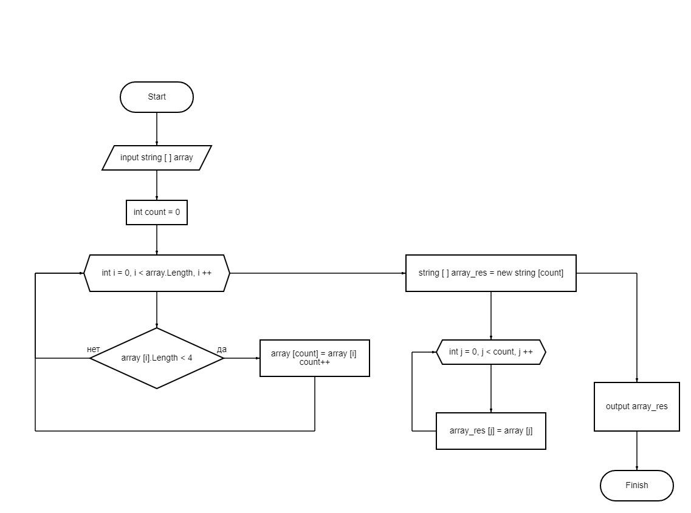

# Itogi_bloka.
Итоги блока. Выбор специализации.

## Что необходимо сделать:

1. Создать репозиторий на GitHub
2. Нарисовать блок-схему алгоритма (можно обойтись блок-схемой основной содержательной части, если вы выделяете её в отдельный метод)
3. Снабдить репозиторий оформленным текстовым описанием решения (файл README.md)
4. Написать программу, решающую поставленную задачу
5. Использовать контроль версий в работе над этим небольшим проектом (не должно быть так, что всё залито одним коммитом, как минимум этапы 2, 3, и 4 должны быть расположены в разных коммитах)

## Задача: 
### Написать программу, которая из имеющегося массива строк формирует новый массив из строк, длина которых меньше, либо равна 3 символам. Первоначальный массив можно ввести с клавиатуры, либо задать на старте выполнения алгоритма. При решении не рекомендуется пользоваться коллекциями, лучше обойтись исключительно массивами.

*Примеры:*

*[“Hello”, “2”, “world”, “:-)”] → [“2”, “:-)”]*

*[“1234”, “1567”, “-2”, “computer science”] → [“-2”]*

*[“Russia”, “Denmark”, “Kazan”] → []*

***

## Алгоритм решения:
1. Создаем исходный массив строк.
2. Делаем проверку элементов исходного массива на соответствие условию задачи (длина строки меньше или равна 3 символам) до тех пор, пока не получается.
3. Если элемент соответствует условию, то записывает его значение в новый массив строк, присваевая индекс в соотношении с упорядоченностью очередности записи строк в массиве.
4. Выводим новый созданный массив строк.

## Блок - схема алгоритма:

 ## Программа, решающая поставленную задачу:
 
 https://github.com/AnastasyHavura/Itogi_bloka./blob/0be0542b91308c8eb69e3be34e52af0f86c67934/Program.cs

 
